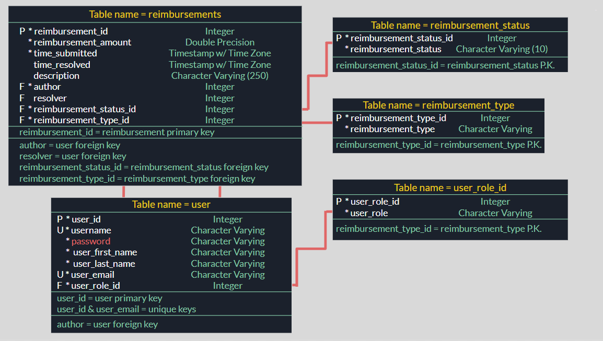
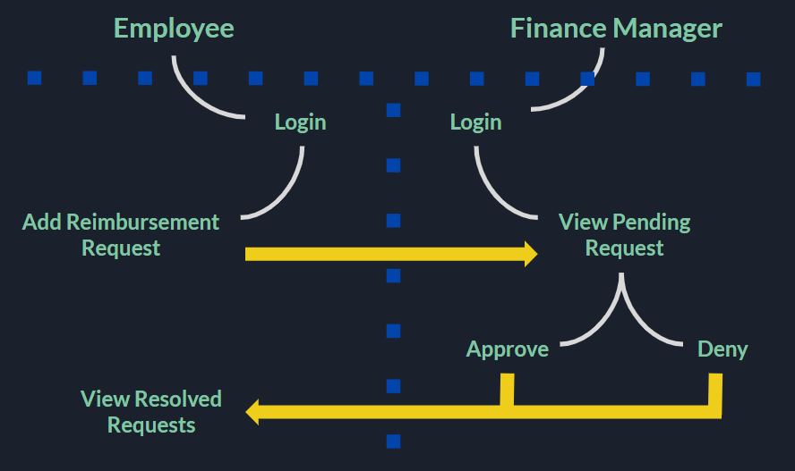

# Project: Employee Reimbursment System (ERS)

PROJECT DEMO VIDEO

https://www.loom.com/share/e51e9d02d8954ef291c312f5a9e69fc5

-- TECH STACK -- 

Front End:
- HTML w/ JSP
- CSS 
- (Zero Functional Lines of JavaScript)

Back End:
- Java
- Maven
- JDBC
- Java Servlet

Database:
- Postgres (locally hosted)

## Executive Summary
* The Expense Reimbursement System (ERS) will manage the process of reimbursing employees for expenses incurred while on company time. 
* All employees in the company can login and submit requests for reimbursement and view their past tickets and pending requests. 
* Finance managers can log in and view all reimbursement requests and past history for all employees in the company. 
* Finance managers are authorized to approve and deny requests for expense reimbursement.

#### Employee User Stories 
- An Employee can login
- An Employee can view the Employee Homepage
- An Employee can logout
- An Employee can submit a reimbursement request
- An Employee can view their pending reimbursement requests
- An Employee can view their resolved reimbursement requests
- An Employee can view their information
- An Employee can update their information

#### Manager User Stories
- A Manager can login
- A Manager can view the Manager Homepage
- A Manager can logout
- A Manager can approve/deny pending reimbursement requests
- A Manager can view all pending requests from all employees
- A Manager can view all resolved requests from all employees and see which manager resolved it
- A Manager can view all Employees
- A Manager can view reimbursement requests from a single Employee 

**State-chart Diagram (Reimbursement Statuses)** 

**Reimbursement Types**

Employees must select the type of reimbursement as: LODGING, TRAVEL, FOOD, or OTHER.

**Logical Model**

**Physical Model**

**Use Case Diagram**

**Activity Diagram**

## Technical Requirements

* The application shall deploy onto a Tomcat Server. 
* The middle tier shall use Servlet technology for dynamic Web application development. 
* The front-end view shall use HTML/JSP to make an application that can call server-side components. 

